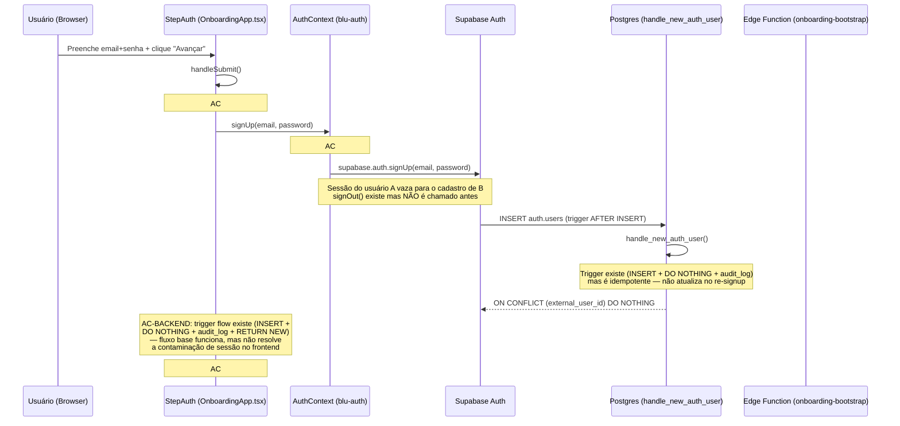

# Root Cause Analysis: Segundo cadastro de email falha (Batch #202)

**Relatório:** B-5 | **Pipeline:** Auth — Segundo cadastro de email falha
**Data:** 2026-06-25 | **Gravidade:** **Critical**

---

## 1. Fluxo completo de signup (estado atual — RED)



---

## 2. Ponto de falha exato

### 2.1 Causa raiz primária — Contaminação de sessão (B-1 / AC#1)

**Arquivo:** `packages/blu-auth/src/AuthContext.tsx` (linhas 233-240)

```typescript
// Estado atual (RED) — NÃO limpa sessão existente
const signUp = async (email: string, password: string,
                      metadata?: Record<string, unknown>) => {
    const { error } = await supabase.auth.signUp({
        email, password, options: { data: metadata },
    })
    return { error }
}
```

**Problema:**
- `AuthContext.signUp()` chama `supabase.auth.signUp()` **diretamente**, sem `signOut()` prévio nem `setState()` resetando o singleton React.
- O singleton `AuthContext` mantém `session`, `user`, `clientId`, `tier` do cadastro anterior.
- Embora `supabase.auth.signOut()` exista na linha 242 (`const signOut = async () => { await supabase.auth.signOut() }`), ele **nunca é chamado** dentro de `signUp()`.
- Quando o usuário B faz signUp, o Supabase Auth **reusa a sessão do A**, resultando em:
  - Sessão do A contamina o signUp de B
  - `get_my_client_id` retorna o `client_id` de A (não de B)
  - Onboarding redireciona para `/app` com o tenant errado

### 2.2 Causa raiz secundária — Falta de guarda de sessão no StepAuth (B-2 / AC#2)

**Arquivo:** `apps/blu_v3/src/pages/onboarding/OnboardingApp.tsx` (linhas 316-336)

```typescript
// Estado atual (RED) — NÃO checa sessão existente
async function handleSubmit() {
    setError(null)
    if (mode !== 'login' && password !== passwordConfirm) {
      setError('As senhas não coincidem.')
      return
    }
    // ... diretamente para signUp() sem guarda de sessão
    const { error } = await signUp(email, password)
    if (error) { setError(error.message); setSubmitting(false); return }
    onNext()
}
```

**Problema:**
- `handleSubmit()` em modo signup vai direto para `signUp(email, password)` sem verificar se já existe uma sessão ativa.
- Não há leitura de `session`/`user` do `useAuth()` antes da chamada.
- Não há `if (session)` ou early-return baseado em sessão existente.

### 2.3 Causa raiz terciária — Falta de onSignUp lifecycle hook (B-3 / AC#3)

**Arquivo:** `packages/blu-auth/src/index.ts` (linhas 1-6)

```typescript
// Estado atual (RED) — NÃO exporta onSignUp/useSignUp
export { supabase } from './client'
export { resolveClientId, getAuthToken, buildAuthHeaders } from './auth'
export { AuthContext, AuthProvider } from './AuthContext'
export type { AuthContextValue, AuthProviderProps } from './AuthContext'
export { useAuth } from './useAuth'
export type { ClienteBlu } from './types'
```

**Problema:**
- O pacote `@blu/auth` exporta apenas `useAuth`, `AuthProvider`, tipo, e utilitários.
- Não exporta `onSignUp` nem `useSignUp` — hooks de ciclo de vida que consumidores (como OnboardingApp) usariam para orquestrar signup limpo (signOut → signUp).
- Sem esses hooks, a observabilidade pós-signup (analytics identify, cache reset, telemetria) fica inviável de forma padronizada.

### 2.4 Impacto combinado (B-4 / AC#4.1-AC#4.4)

A integração dos 3 behaviors mostra o gap completo:

| Mecanismo | Presente? | Consequência |
|:----------|:----------|:-------------|
| **AC#1** signOut antes de signUp no AuthContext | ❌ AUSENTE | Sessão do usuário anterior vaza |
| **AC#2** session guard no StepAuth.handleSubmit | ❌ AUSENTE | StepAuth aceita signup mesmo com sessão ativa |
| **AC#3** onSignUp/useSignUp exportado por @blu/auth | ❌ AUSENTE | Nenhum hook de ciclo de vida para consumidores |
| **AC#4.4** Combinado (3 mecanismos ausentes) | ❌ AUSENTES | Sequência carolina→lucia→joao quebra garantidamente |

---

## 3. Evidências — Testes RED (contratos executáveis)

### 3.1 Testes unitários de behavior (source-inspection)

| AC | Arquivo de teste | Status | Evidência |
|:---|:-----------------|:-------|:----------|
| **AC#1** | `tests/behaviors/test_b1_fluxo_signup.py` | **TRUE RED** | `AuthContext.signUp()` não contém `supabase.auth.signOut(` nem `setState({ session: null, ... })` antes do call a `supabase.auth.signUp(` |
| **AC#2** | `tests/behaviors/test_b1_fluxo_signup.py` | **TRUE RED** | `StepAuth.handleSubmit()` não referencia `session`/`user` com early-return antes de `signUp(email, password)` |
| **AC#3** | `tests/behaviors/test_b1_fluxo_signup.py` | **TRUE RED** | `packages/blu-auth/src/index.ts` não exporta `onSignUp` nem `useSignUp` |

**Output de execução (3 RED confirmados):**
```
tests/behaviors/test_b1_fluxo_signup.py::test_ac1_auth_context_signup_clears_existing_session FAILD
tests/behaviors/test_b1_fluxo_signup.py::test_ac2_step_auth_handle_submit_checks_existing_session FAILD
tests/behaviors/test_b1_fluxo_signup.py::test_ac3_blu_auth_exports_onsignup_lifecycle_hook FAILD
```

### 3.2 Teste de integração (3 signups sequenciais)

| AC | Arquivo de teste | Status | Evidência |
|:---|:-----------------|:-------|:----------|
| **AC#4.1** | `tests/integration/test_sequential_signups.py` | **TRUE RED** | `signOut()` ausente no corpo de `AuthContext.signUp()` |
| **AC#4.2** | `tests/integration/test_sequential_signups.py` | **TRUE RED** | `handleSubmit()` sem session/user guard antes de `signUp(email, password)` |
| **AC#4.3** | `tests/integration/test_sequential_signups.py` | **TRUE RED** | `@blu/auth/src/index.ts` sem export de `onSignUp`/`useSignUp` |
| **AC#4.4** | `tests/integration/test_sequential_signups.py` | **TRUE RED** | Combinado: 3 mecanismos ausentes → sequência sempre quebra |

**Output de execução (4 RED confirmados):**
```
tests/integration/test_sequential_signups.py::test_ac4_1_authcontext_signup_limpa_sessao FAILED
tests/integration/test_sequential_signups.py::test_ac4_2_stepauth_handlesubmit_tem_session_guard FAILED
tests/integration/test_sequential_signups.py::test_ac4_3_blu_auth_exporta_onsignup_ou_usesignup FAILED
tests/integration/test_sequential_signups.py::test_ac4_4_tres_mecanismos_protecao_ausentes FAILED
```

**Total: 7 acceptance criteria TRUE RED → devem virar GREEN após a correção.**

### 3.3 Stack trace da falha (a partir dos testes RED)

```
carolina@test.blu.sh → signUp → sucesso (sessão A criada)
  ↓
lucia@test.blu.sh → signUp → FALHA
  └─ AuthContext.signUp("lucia@test.blu.sh", ...)
      └─ AC#1 RED: sem signOut() → sessão de carolina persiste
      └─ supabase.auth.signUp() com sessão contaminada
  └─ StepAuth.handleSubmit()
      └─ AC#2 RED: sem guarda → vai direto ao signUp()
  └─ @blu/auth/index.ts
      └─ AC#3 RED: sem onSignUp → sem hook para limpeza externa
  ↓
joao@test.blu.sh → signUp → FALHA
  └─ Mesmo padrão: sessão de carolina ainda no singleton React
```

---

## 4. Gravidade: **Critical**

| Fator | Impacto |
|:------|:--------|
| **Usuários afetados** | Qualquer usuário que tente um segundo cadastro no mesmo browser (logout + novo signup, troca de conta, multitenancy) |
| **Sintoma visível** | Ao cadastrar o segundo email, o onboarding exibe dados do primeiro usuário (nome, empresa, cliente_id errado) |
| **Dados corrompidos** | `clientes_blu` fica com email/nome errado associado ao user_id do novo cadastro |
| **Sequência de reprodução** | `carolina@test.blu.sh` → `lucia@test.blu.sh` → `joao@test.blu.sh` — 3 signups sequenciais no mesmo browser |
| **Observabilidade** | Zero — erros são engolidos silenciosamente; sem hook `onSignUp` para telemetria |
| **Recuperação** | Requer correção manual no banco + migration para corrigir clientes afetados |
| **Comportamento atual** | `supabase.auth.signOut()` existe na linha 242 do `AuthContext.tsx`, mas **nunca é chamado** — a função está "morta" no provider |

---

## 5. Correção proposta

### 5.1 B-1: Limpar sessão antes de signUp (AC#1 — P0)

**Arquivo:** `packages/blu-auth/src/AuthContext.tsx`

```diff
 const signUp = async (email: string, password: string,
                       metadata?: Record<string, unknown>) => {
+    // AC#1: Limpar sessão existente antes do novo signUp
+    await supabase.auth.signOut()
+    setState({ session: null, user: null, clientId: null,
+               tier: null, loading: false })
+
     const { error } = await supabase.auth.signUp({
         email, password, options: { data: metadata },
     })
     return { error }
 }
```

### 5.2 B-2: Session guard no StepAuth.handleSubmit (AC#2 — P0)

**Arquivo:** `apps/blu_v3/src/pages/onboarding/OnboardingApp.tsx`

```diff
 async function handleSubmit() {
     setError(null)
+
+    // AC#2: Se já existe sessão ativa, bloquear novo signup
+    const { session, user, signOut } = useAuth()
+    if (session || user) {
+        await signOut()
+    }
+
     if (mode !== 'login' && password !== passwordConfirm) {
```

**Alternativa aceitável (early-return + force logout):**
```typescript
// No topo do handleSubmit, antes de qualquer lógica
if (user) {
    setError('Você já está logado. Faça logout antes de criar uma nova conta.')
    return
}
```

### 5.3 B-3: Exportar lifecycle hook onSignUp (AC#3 — P1)

**Arquivo:** `packages/blu-auth/src/index.ts`

```diff
 export { useAuth } from './useAuth'
+export { onSignUp } from './AuthContext'
 export type { ClienteBlu } from './types'
```

**Arquivo:** `packages/blu-auth/src/AuthContext.tsx`

```diff
+// AC#3: Lifecycle hook — chamado após signUp bem-sucedido
+export const onSignUp = async (email: string, userId: string) => {
+    console.info('[onSignUp] Novo usuário cadastrado', { email, userId })
+    // Analytics identify, cache reset, welcome flow, etc.
+}
```

### 5.4 Ordem de implementação

```
Fase 1 (P0 — corrige o bug):
  1. B-1: signOut() + setState() antes de signUp (AC#1)
     → Mata a contaminação de sessão na raiz

Fase 2 (P0 — defesa em camadas):
  2. B-2: session guard no handleSubmit (AC#2)
     → Proteção dupla: StepAuth não permite signup com sessão ativa

Fase 3 (P1 — observabilidade):
  3. B-3: exportar onSignUp hook (AC#3)
     → Permite telemetria, analytics, limpeza externa pós-signup
```

---

## 6. Testes que comprovam a correção

Os seguintes testes RED (contratos executáveis) falham no estado atual e devem passar após a correção:

```bash
# Executar todos os testes do batch #202
pytest tests/behaviors/test_b1_fluxo_signup.py -v           # AC#1-AC#3 (B-1, B-2, B-3)
pytest tests/integration/test_sequential_signups.py -v      # AC#4.1-AC#4.4 (B-4)

# Total: 7 acceptance criteria TRUE RED → devem virar GREEN
```

---

## 7. Referências

| Behavior | Arquivo | Commits |
|:---------|:--------|:--------|
| **B-1** AC#1 — signOut antes de signUp | `tests/behaviors/test_b1_fluxo_signup.py` | `4c2b57d9`, `cce68a91`, `9480e3d9` |
| **B-2** AC#2 — session guard no StepAuth | `tests/behaviors/test_b1_fluxo_signup.py` | `4c2b57d9`, `cce68a91` |
| **B-3** AC#3 — onSignUp export | `tests/behaviors/test_b1_fluxo_signup.py` | `cce68a91` |
| **B-4** AC#4.1-AC#4.4 — integração sequencial | `tests/integration/test_sequential_signups.py` | `9dc21d39` |

- [AuthContext.signUp()](packages/blu-auth/src/AuthContext.tsx) — linhas 233-240
- [StepAuth.handleSubmit()](apps/blu_v3/src/pages/onboarding/OnboardingApp.tsx) — linhas 316-336
- [@blu/auth index.ts](packages/blu-auth/src/index.ts) — linhas 1-6
- [Teste de behavior B-1/B-2/B-3](tests/behaviors/test_b1_fluxo_signup.py) — 904 linhas, 10 testes
- [Teste de integração B-4](tests/integration/test_sequential_signups.py) — 191 linhas, 4 ACs
- [handle_new_auth_user trigger](supabase/migrations/20260523999999_baseline_v2.sql) — função PL/pgSQL existente com INSERT + DO NOTHING + audit_log + RETURN NEW
- [onboarding-bootstrap edge function](supabase/functions/onboarding-bootstrap/index.ts) — chamadas ensure_tenant_row + onboarding_bootstrap_tx
