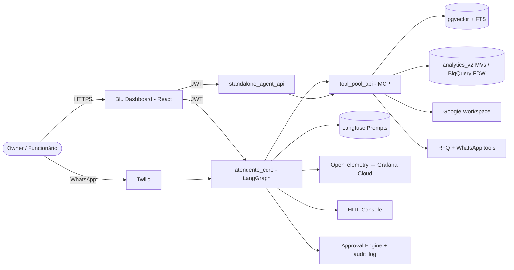

# Blu MVP — Product Roadmap & Backlog

`[DRAFT]`
**Owner:** Product · **Status date:** 2026-04-26 · **Target tier(s):** BASIC, PRO (ENTERPRISE post-MVP)

> Naming: the product is **Blu**. The repo still uses the `vizu_*` namespace in libs, services, and schemas. References below to `vizu_*` identifiers are deliberate — they point at code paths, not user-facing copy.

---

## 1. Context

Blu is an AI-powered back-office manager for Brazilian SMBs. The platform already has the structural pieces for an MVP:

- **Multi-agent orchestrator** (`services/atendente_core`) with LangGraph + MCP
- **Standalone agent runtime** (`services/standalone_agent_api`) with session lifecycle, CSV/document upload, config helper, agent chat ([phase-4](../../) → phase-6 + phase-B builder completed)
- **Tool pool MCP** ([services/tool_pool_api](../../services/tool_pool_api/)) exposing SQL, RAG, CSV, RFQ, RFQ-WhatsApp, Google Workspace, document-intelligence, OCR, web-monitor tools
- **Analytics layer** (`analytics_v2`) — slim star schema (`fato_transacoes`, 4 dims), nightly MVs (`mv_resumo_dashboard`, etc.) and security-invoker views, with `get_dashboard_indicators(p_period)` RPC live
- **Landing onboarding** wired to Supabase Auth → `clientes_vizu` trigger, `client_enabled_agents`, `client_routines`, 8 canonical agent slugs seeded
- **Dashboard** (`apps/vizu_dashboard`) with HomePage, generic list/overview pages, settings, admin agent builder
- **Procurement (RFQ)** Phase 1 + Phase 2 tools shipped (mock + WhatsApp dispatch, LLM reply parser, optimization, PO draft/approve)

The MVP must turn these moving parts into a **cohesive, observable product** that an SMB owner can trust within their first week.

---

## 2. Objective

Ship a paid-ready BASIC + PRO experience by **end of Q3 2026** that lets a Brazilian SMB connect a data source and, within 24 hours, receive trustworthy reports, KPI dashboards, and at least one closed procurement or consumer-communication loop — fully audited and LGPD-compliant.

**North-star metric:** % of `BASIC`/`PRO` tenants with **≥1 approved action** (PO, sent message, exported report) **within 7 days of activation**. Target ≥ 40 % at MVP launch.

---

## 3. MVP Scope (the five pillars)

| #   | Pillar                             | Owner agent(s)                              | Primary surface                                      |
| --- | ---------------------------------- | ------------------------------------------- | ---------------------------------------------------- |
| 1   | KPI definitions + dashboard wiring | Analytics, Inventory, Comercial, Financeiro | `apps/vizu_dashboard` HomePage + dimension pages     |
| 2   | Insights from ingested data        | Analytics + Routines                        | HomePage cards, Insights feed, WhatsApp digest (PRO) |
| 3   | Procurement tasks                  | Supply (RFQ) + Approval Engine              | Pedidos page + WhatsApp                              |
| 4   | Consumer communication             | Comercial + CRM                             | Inbox page + WhatsApp                                |
| 5   | Reports & document generation      | Report Composer + Document Intelligence     | Reports page + Drive/Sheets export                   |

Cross-cutting non-functionals: **<3 s** dashboard load (cached MVs), **streaming agent replies via SSE**, RLS on every tenant table, audit log on every approved action, Langfuse-managed prompts with in-repo fallbacks, OTel traces to Grafana Cloud.

---

## 4. High-Level Architecture (MVP)

---

## 5. Roadmap (4 phases, ~12 weeks)

> Phases run sequentially per pillar but **Pillar 1 (KPIs) blocks Pillars 2 and 5**. Procurement and consumer comms can run in parallel once Pillar 1 lands.

### Phase 0 — MVP Foundations (2 weeks)

Goal: lock the contracts every other phase depends on.

- **F0.1** Finalize KPI catalog per dimension (see §6) — committed in `docs/internal/kpi-catalog.md`.
- **F0.2** Freeze the `analytics_v2` view contract: which views/columns are LLM-callable (`ExecutionConfig.allowed_views` / `allowed_columns`).
- **F0.3** Approval Engine v1 — table `approval_requests` (per-tenant, RLS), tier rules in `client_enabled_agents`, dispatch helper in `libs/vizu_agent_framework`.
- **F0.4** `audit_log` table + `record_audit(action, actor, payload)` RPC; every MCP tool that mutates state writes one row.
- **F0.5** Langfuse prompt audit — every MVP prompt has a `production` label and an in-repo fallback under `libs/vizu_prompt_management/prompts/<domain>/<slug>.md`.

### Phase 1 — KPIs & Dashboard Wiring (3 weeks)

Goal: every dimension page shows real numbers from real data, with the right tier gating.

- **K1.1** ✅ Replace remaining placeholders in [`docs/dashboard-placeholders.md`](../dashboard-placeholders.md) with live RPCs.
- **K1.2** ✅ Add per-dimension RPCs: `get_finance_indicators`, `get_inventory_indicators`, `get_commercial_indicators`, `get_supply_indicators`, `get_marketing_indicators` (all parameterized by `p_period`, all `security_invoker`) — migration `20260426234500_phase1_dimension_indicators.sql`.
- **K1.3** ✅ Frontend: introduce `useDimensionKpis(dimension, period)` in `apps/vizu_dashboard/src/hooks/`; fan out to `analyticsService`.
- **K1.4** ✅ Period selector standardization — `7d | 30d | 90d | mtd | ytd | custom` — single component reused across pages (`PeriodSelector`).
- **K1.5** ✅ Empty-state (`EmptyStateCard`) and degraded-state UX (`StaleDataPill`) per Fallbacks §10.

### Phase 2 — Insights & Routines (2 weeks)

Goal: the agent layer surfaces actionable observations on top of the KPIs.

- **I2.1** `routine.daily_insights` — runs nightly per tenant, calls Analytics agent, writes top-5 insights to `client_insights` (new table).
- **I2.2** Insights feed component on HomePage (cards + dismiss + "explicar" → opens `atendente_core` thread).
- **I2.3** PRO: WhatsApp digest at 08:00 (tenant tz) via Twilio.
- **I2.4** Anomaly detection prompt fragment — variance >2σ vs trailing 30d on key KPIs.

### Phase 3 — Procurement & Consumer Comms (3 weeks, parallel)

#### 3A. Procurement (Supply / RFQ)

- **P3.1** Wire RFQ tools into the **Approval Engine** — `create_purchase_order` and `approve_purchase_order` raise `ElicitationRequired` via `vizu_elicitation_service`. (Closes gap #1 in [rfq-agent memory](../../).)
- **P3.2** Twilio webhook ingest in `tool_pool_api` → auto-call `parse_supplier_reply`. (Closes gap #5.)
- **P3.3** RFQ workflow node wiring (`rfq_wait_responses_node`) into the Supply agent graph; auto-follow-up at T-12 h, T-2 h.
- **P3.4** Pedidos page polish: live RFQ status, optimization preview, PO export to Google Sheets.

#### 3B. Consumer Communication (Comercial / CRM)

- **C3.1** Inbox page (`apps/vizu_dashboard/src/pages/InboxPage.tsx`) — unified view of WhatsApp + Gmail threads scoped by tenant.
- **C3.2** Comercial agent: drafts replies, requires owner approval before send (BASIC: always; PRO: threshold-based via Approval Engine).
- **C3.3** Conversation memory per contact in `pgvector` — reuse `libs/vizu_rag_factory`.
- **C3.4** Outbound campaigns (PRO): owner-approved templates, dispatched via Twilio, tracked in `audit_log`.

### Phase 4 — Reports & Document Generation (2 weeks)

Goal: any KPI / insight / RFQ / conversation thread can be turned into a polished deliverable.

- **R4.1** New MCP tool `generate_report(template, period, dimensions, format)` in `tool_pool_api/server/tool_modules/report_module.py` — composes Markdown via Langfuse `fragment/report-*` prompts.
- **R4.2** Format outputs: Markdown (in-app), PDF (via WeasyPrint or Cloud Run print service), Google Docs (via `vizu_google_suite_client`), XLSX (via `pandas`).
- **R4.3** Reports page: catalog of templates (Mensal Comercial, Estoque Crítico, Cotações do Mês, Caixa Semanal), schedule UI (PRO).
- **R4.4** Document intelligence loop: ingested PDFs → `document_intelligence_module` → structured fields available as report inputs.

---

## 6. KPI Catalog (research-backed — supersedes ad-hoc placeholders)

> All KPIs are scoped by `client_id` (RLS) and computed from `analytics_v2.fato_transacoes` + dim aggregates unless noted. Period parameter follows §K1.4.
>
> **Sourcing:** definitions follow the conventions used by Corporate Finance Institute / Investopedia (financial ratios), CFA Institute (working-capital metrics), Salesforce / HBR (sales), APICS-ASCM CPIM body of knowledge (inventory), CIPS / ISM and the Hackett Group (procurement), Bain & Company / AMA (customer & marketing). See §17 for canonical references.

Conventions:

- **Tipo**: `Lagging` (resultado já ocorrido) vs `Leading` (sinal preditivo) — taxonomy from Investopedia / Kaplan & Norton's Balanced Scorecard.
- **Fórmula**: shown in standard accounting form; SQL views translate them against `analytics_v2`.
- **Fonte**: business reference followed by repo source.

### 6.1 Financeiro (Finance)

Frameworks: CFI Financial KPI taxonomy, Investopedia liquidity/profitability/solvency/turnover ratios, CFA working-capital management.

| KPI                                   | Fórmula                                                | Tipo    | Fonte/Origem                   | Tier  |
| ------------------------------------- | ------------------------------------------------------ | ------- | ------------------------------ | ----- |
| Receita líquida (Net Revenue)         | `Σ valor WHERE tipo='receita' AND status<>'cancelled'` | Lagging | `fato_transacoes`              | BASIC |
| Custo total (COGS + OPEX)             | `Σ valor WHERE tipo IN ('despesa','custo')`            | Lagging | `fato_transacoes`              | BASIC |
| Margem bruta (Gross Margin %)         | `(Receita − COGS) / Receita`                           | Lagging | derived                        | BASIC |
| Margem operacional (EBIT %)           | `(Receita − COGS − OPEX) / Receita`                    | Lagging | derived                        | BASIC |
| Ticket médio (AOV)                    | `Receita / nº pedidos`                                 | Lagging | `mv_resumo_dashboard`          | BASIC |
| DSO — Days Sales Outstanding          | `(AR médio / Receita) × dias`                          | Lagging | `fato_transacoes` + status     | PRO   |
| DPO — Days Payable Outstanding        | `(AP médio / COGS) × dias`                             | Lagging | `fato_transacoes` (despesas)   | PRO   |
| Cash Conversion Cycle                 | `DIO + DSO − DPO`                                      | Lagging | derived                        | PRO   |
| Working Capital Ratio (Current Ratio) | `Ativo circulante / Passivo circulante`                | Leading | `fato_transacoes` saldos       | PRO   |
| Burn rate mensal                      | `Σ saídas operacionais / mês`                          | Leading | `fato_transacoes`              | PRO   |
| Runway (meses)                        | `Caixa atual / Burn rate`                              | Leading | derived                        | PRO   |
| Fluxo de caixa projetado 30 d         | `Σ recebíveis 30d − Σ pagáveis 30d`                    | Leading | `fato_transacoes` future-dated | PRO   |
| Receita YoY (%)                       | `(Receita período − Receita período-1A) / período-1A`  | Lagging | derived                        | BASIC |

### 6.2 Comercial (Sales / CRM)

Frameworks: Salesforce State of Sales, HBR sales-management literature, Bain customer-economics (NPS, retention).

| KPI                                       | Fórmula                                                           | Tipo    | Fonte          | Tier  |
| ----------------------------------------- | ----------------------------------------------------------------- | ------- | -------------- | ----- |
| Pedidos no período                        | `COUNT(*) FROM fato_transacoes WHERE tipo='venda'`                | Lagging | fato           | BASIC |
| Receita por canal                         | `group by canal`                                                  | Lagging | fato           | BASIC |
| Top 10 clientes (Pareto / 80–20)          | `mv_resumo_clientes ORDER BY receita_total DESC LIMIT 10`         | Lagging | MV             | BASIC |
| Win-rate (lead→pedido)                    | `pedidos / leads_qualificados`                                    | Lagging | CRM events     | PRO   |
| Ciclo de venda médio (Sales Cycle Length) | `avg(data_pedido − data_primeiro_contato)`                        | Lagging | CRM events     | PRO   |
| Frequência de compra                      | `dim_clientes.frequencia_mensal`                                  | Lagging | dim            | PRO   |
| Recência média (RFM-R)                    | `avg(dias_recencia)`                                              | Leading | `dim_clientes` | PRO   |
| Churn 60 d (%)                            | `clientes_inativos_60d / clientes_ativos_60d_atrás`               | Lagging | derived        | PRO   |
| Net Revenue Retention                     | `Σ receita coorte t / Σ receita coorte t-1`                       | Lagging | cohort SQL     | PRO   |
| Customer Lifetime Value (CLV)             | `Ticket médio × Frequência × Tempo médio retenção` (Bain formula) | Leading | derived        | PRO   |
| Taxa de conversão checkout (e-com)        | `pedidos / sessões`                                               | Lagging | conector e-com | PRO   |
| NPS (quando coletado)                     | `% promotores − % detratores`                                     | Leading | survey log     | PRO   |

### 6.3 Estoque / Inventory

Frameworks: APICS-ASCM CPIM, Council of Supply Chain Management Professionals (CSCMP) glossary.

| KPI                                      | Fórmula                                                      | Tipo    | Fonte                 | Tier       |
| ---------------------------------------- | ------------------------------------------------------------ | ------- | --------------------- | ---------- |
| SKUs ativos                              | `COUNT FROM dim_inventory WHERE active=true`                 | Lagging | dim                   | BASIC      |
| Inventory Turnover (Giro)                | `COGS / Estoque médio`                                       | Lagging | fato + dim            | PRO        |
| DIO — Days Inventory Outstanding         | `(Estoque médio / COGS) × dias`                              | Lagging | derived               | PRO        |
| Cobertura de estoque (dias)              | `Estoque atual / Consumo médio diário`                       | Leading | derived               | PRO        |
| Stockout rate                            | `SKUs sem estoque / total SKUs`                              | Lagging | dim                   | PRO        |
| Fill rate                                | `Itens entregues / itens pedidos`                            | Lagging | fato vendas + estoque | PRO        |
| Sell-through rate                        | `Unidades vendidas / unidades recebidas no período`          | Lagging | fato + recebimentos   | PRO        |
| GMROI (Gross Margin Return on Inventory) | `Margem bruta / Estoque médio`                               | Lagging | derived               | PRO        |
| Acuracidade do inventário                | `1 − \|estoque sistema − estoque físico\| / estoque sistema` | Leading | contagens             | ENTERPRISE |
| Cobertura de SKU classe A (Pareto)       | `% receita coberto pelos top 20% SKUs`                       | Lagging | derived               | PRO        |

### 6.4 Supply / Procurement

Frameworks: CIPS Global Standard for Procurement, ISM Procurement KPIs, The Hackett Group benchmarks.

| KPI                                          | Fórmula                                                        | Tipo    | Fonte             | Tier       |
| -------------------------------------------- | -------------------------------------------------------------- | ------- | ----------------- | ---------- |
| RFQs abertas                                 | `COUNT FROM rfq_requests WHERE status IN ('sent','responded')` | Lagging | rfq               | BASIC      |
| Tempo médio de resposta de fornecedor        | `avg(responded_at − sent_at)`                                  | Lagging | rfq               | BASIC      |
| Taxa de resposta de RFQ                      | `respondidas / enviadas`                                       | Lagging | rfq               | BASIC      |
| POs aprovadas                                | `COUNT FROM purchase_orders WHERE status='approved'`           | Lagging | po                | BASIC      |
| Cost Savings % (vs baseline / single-source) | `(preço baseline − preço ganhador) / preço baseline`           | Lagging | tool output       | PRO        |
| Price variance (PPV)                         | `(preço atual − preço padrão) × quantidade`                    | Lagging | rfq + histórico   | PRO        |
| Concentração por fornecedor                  | `share% do maior fornecedor (rolling 90d)`                     | Leading | derived           | PRO        |
| OTIF — On-Time In-Full                       | `pedidos entregues no prazo e completos / total pedidos`       | Lagging | po + recebimentos | PRO        |
| Lead time médio de fornecedor                | `avg(data_entrega − data_po)`                                  | Lagging | po                | PRO        |
| Maverick spend %                             | `compras fora-do-processo / compras totais`                    | Lagging | po + audit        | ENTERPRISE |
| Spend under management                       | `Σ spend categorizado / Σ spend total`                         | Lagging | po                | PRO        |
| Cycle time (PR→PO)                           | `avg(po.created_at − requisicao.created_at)`                   | Lagging | derived           | PRO        |

### 6.5 Marketing (PRO-first)

Frameworks: AMA Marketing Metrics, HubSpot/Bain CAC-LTV ratio, Google/Meta attribution definitions.

| KPI                             | Fórmula                                            | Tipo    | Fonte                   | Tier       |
| ------------------------------- | -------------------------------------------------- | ------- | ----------------------- | ---------- |
| CAC — Customer Acquisition Cost | `(Marketing spend + Sales spend) / Novos clientes` | Lagging | external + dim_clientes | PRO        |
| LTV / CAC ratio                 | `CLV / CAC` (saúde alvo ≥ 3)                       | Leading | derived                 | PRO        |
| CAC payback (meses)             | `CAC / Margem bruta mensal por cliente`            | Leading | derived                 | PRO        |
| ROAS — Return on Ad Spend       | `Receita atribuída / Investimento em mídia`        | Lagging | external + fato         | PRO        |
| Conversão de campanha           | `respostas / mensagens enviadas`                   | Lagging | `audit_log` outbound    | PRO        |
| Click-Through Rate (CTR)        | `cliques / impressões`                             | Lagging | external                | PRO        |
| Engajamento WhatsApp            | `mensagens lidas / mensagens enviadas`             | Leading | Twilio webhook          | PRO        |
| Taxa de opt-out                 | `opt-outs / mensagens enviadas`                    | Leading | Twilio webhook          | PRO        |
| Share of voice (ad-hoc)         | `menções da marca / menções totais no setor`       | Lagging | external                | ENTERPRISE |

### 6.6 Administrativo & Operacional

Frameworks: Balanced Scorecard internal-process perspective; Lean cycle-time metrics.

| KPI                                    | Fórmula                                               | Tipo    | Fonte             | Tier  |
| -------------------------------------- | ----------------------------------------------------- | ------- | ----------------- | ----- |
| Aprovações pendentes                   | `COUNT FROM approval_requests WHERE status='pending'` | Leading | approval          | BASIC |
| Lead-time médio de aprovação           | `avg(decided_at − created_at)`                        | Lagging | approval          | PRO   |
| SLA de aprovação (% no prazo)          | `aprovações no SLA / total`                           | Lagging | approval          | PRO   |
| Documentos sem categoria               | `COUNT FROM fonte_de_dados WHERE categoria IS NULL`   | Leading | upload            | BASIC |
| Cobertura de rotinas ativas            | `rotinas ativas / rotinas disponíveis no tier`        | Leading | `client_routines` | BASIC |
| Frescor dos dados (data freshness)     | `now() − max(updated_at) por dim/fato`                | Leading | fato + dim        | BASIC |
| Auditabilidade (% ações com audit_log) | `audit_log entries / mutating tool calls`             | Leading | OTel + audit_log  | BASIC |

### 6.7 Resumo de aplicabilidade por ICP

| Setor SMB típico       | Dimensões críticas (must-have)        | Dimensões opcionais       |
| ---------------------- | ------------------------------------- | ------------------------- |
| Varejo / e-commerce    | Comercial, Estoque, Financeiro        | Marketing, Supply         |
| Distribuição / atacado | Supply, Estoque, Financeiro           | Comercial                 |
| Serviços               | Financeiro, Comercial, Administrativo | Marketing                 |
| Indústria leve         | Supply, Estoque, Financeiro           | Comercial, Administrativo |

> **Per-KPI implementation rule:** every KPI above is exposed by a single SQL view in `analytics_v2` **and** an RPC parameterized by `p_period`. Frontend only calls RPCs — no ad-hoc SELECTs from React. KPIs flagged `PRO`/`ENTERPRISE` ship behind feature flags in `client_enabled_agents`.

---

## 7. Backlog (epic → ticket)

> IDs prefixed `BLU-MVP-`. Status: ☐ open, ☑ done. Estimates are story points.

### EPIC-A · Foundations

- BLU-MVP-001 ☐ (3) Approval Engine schema + RLS + RPCs
- BLU-MVP-002 ☐ (2) `audit_log` table + `record_audit()` helper used by every mutating tool
- BLU-MVP-003 ☐ (3) Langfuse prompt-fallback inventory script + CI check
- BLU-MVP-004 ☑ (2) Period selector primitive + `useDimensionKpis` hook
- BLU-MVP-005 ☐ (2) `kpi-catalog.md` reviewed + sign-off

### EPIC-B · KPI Backend

- BLU-MVP-010 ☑ (3) `get_finance_indicators(p_period)` view + RPC
- BLU-MVP-011 ☑ (3) `get_commercial_indicators(p_period)`
- BLU-MVP-012 ☑ (3) `get_inventory_indicators(p_period)`
- BLU-MVP-013 ☑ (3) `get_supply_indicators(p_period)`
- BLU-MVP-014 ☑ (5) `get_marketing_indicators(p_period)` (PRO)
- BLU-MVP-015 ☐ (2) MV refresh schedule (Cron) + alert on staleness >25 h

### EPIC-C · Dashboard Frontend

- BLU-MVP-020 ☐ (5) HomePage live cards (replace mocks)
- BLU-MVP-021 ☐ (5) Financeiro / Comercial / Estoque / Supply pages on real RPCs
- BLU-MVP-022 ☑ (3) Empty + degraded states + "última atualização" pill
- BLU-MVP-023 ☐ (3) Insights feed component on HomePage
- BLU-MVP-024 ☐ (3) Approvals tray (header bell + page)

### EPIC-D · Insights & Routines

- BLU-MVP-030 ☐ (5) `routine.daily_insights` worker + `client_insights` table
- BLU-MVP-031 ☐ (3) Anomaly detection prompt fragment + tests
- BLU-MVP-032 ☐ (5) WhatsApp daily digest (PRO)
- BLU-MVP-033 ☐ (2) "Explicar" deep-link from insight → `atendente_core` thread

### EPIC-E · Procurement

- BLU-MVP-040 ☐ (5) Wire `create_purchase_order` / `approve_purchase_order` to Approval Engine via `ElicitationRequired`
- BLU-MVP-041 ☐ (5) Twilio inbound webhook → `parse_supplier_reply` auto-trigger
- BLU-MVP-042 ☐ (5) `rfq_wait_responses_node` integration in Supply graph + follow-ups
- BLU-MVP-043 ☐ (3) Pedidos page: live RFQ status, optimization preview
- BLU-MVP-044 ☐ (3) PO export to Google Sheets

### EPIC-F · Consumer Communication

- BLU-MVP-050 ☐ (5) Inbox page — Twilio + Gmail unified threads
- BLU-MVP-051 ☐ (5) Comercial agent draft + approval-gated send
- BLU-MVP-052 ☐ (3) Per-contact RAG memory (`pgvector`)
- BLU-MVP-053 ☐ (5) Outbound campaign template runner (PRO)

### EPIC-G · Reports & Documents

- BLU-MVP-060 ☐ (5) `report_module` MCP tool + 4 templates
- BLU-MVP-061 ☐ (3) PDF export (WeasyPrint Cloud Run service)
- BLU-MVP-062 ☐ (3) Google Docs export via `vizu_google_suite_client`
- BLU-MVP-063 ☐ (3) Reports page UI + scheduling (PRO)
- BLU-MVP-064 ☐ (3) Document Intelligence → structured fields available as report inputs

### EPIC-H · Observability & Hardening

- BLU-MVP-070 ☑ (3) OTel spans on every MCP tool with consistent attrs (`client_id`, `tier`, `tool_name`)
- BLU-MVP-071 ☑ (3) Grafana dashboard: tool latency p50/p95, error rate, approvals queued
- BLU-MVP-072 ☑ (2) Alert: MV staleness, RFQ webhook failure, Langfuse outage
- BLU-MVP-073 ☑ (3) RLS regression test suite (extends `tests/test_dashboard_rpcs.py`)

---

## 8. Tier Matrix (MVP-wide)

| Capability                          | BASIC |    PRO     | ENTERPRISE | ADMIN |
| ----------------------------------- | :---: | :--------: | :--------: | :---: |
| Dashboard KPIs (Fin/Com/Est/Supply) |   ✓   |     ✓      |     ✓      |   ✓   |
| Marketing KPIs                      |   —   |     ✓      |     ✓      |   ✓   |
| Daily insights feed (in-app)        |   ✓   |     ✓      |     ✓      |   ✓   |
| WhatsApp daily digest               |   —   |     ✓      |     ✓      |   ✓   |
| RFQ dispatch (mock)                 |   ✓   |     ✓      |     ✓      |   ✓   |
| RFQ via WhatsApp                    |   —   |     ✓      |     ✓      |   ✓   |
| Approval Engine (owner-only)        |   ✓   |     ✓      |     ✓      |   ✓   |
| Approval Engine (role/threshold)    |   —   |     ✓      |     ✓      |   ✓   |
| Inbox (WhatsApp + Gmail)            | read  | read+reply |    full    | full  |
| Outbound campaigns                  |   —   |     ✓      |     ✓      |   ✓   |
| Reports (Markdown + PDF)            |   ✓   |     ✓      |     ✓      |   ✓   |
| Reports (Google Docs / scheduled)   |   —   |     ✓      |     ✓      |   ✓   |
| Multi-user roles                    |   —   |     —      |     ✓      |   ✓   |

---

## 9. Approval & Privilege

- Default tiers per action live in `client_enabled_agents.approval_policy` (JSONB).
- `{{APPROVAL_TIER}}` resolution order: action-specific override → role policy → tier default → fallback "Owner-only".
- Routing: `approve_purchase_order` → user with role `finance-responsible` if set, else owner. Outbound message → owner. Report scheduling → owner.
- Every approval writes to `audit_log` with `actor`, `action`, `payload_hash`, `decision`, `decided_at`.

---

## 10. Fallbacks & Failure Modes

| Failure                  | UX                                                | Backend behavior                                                            |
| ------------------------ | ------------------------------------------------- | --------------------------------------------------------------------------- |
| MV stale > 25 h          | "Última atualização: há X h" warning pill         | Trigger `REFRESH MATERIALIZED VIEW CONCURRENTLY`; alert on second failure   |
| Data source disconnected | Card shows "Conexão indisponível" + reconnect CTA | Skip KPI, log span event `kpi.skipped`                                      |
| Langfuse unreachable     | Agent still answers                               | Fall back to in-repo prompt under `libs/vizu_prompt_management/prompts/...` |
| Twilio outbound fails    | Approval marks `failed`, retries 3× with backoff  | Audit log entry + insight card                                              |
| Approval timeout (>72 h) | Auto-cancel, notify owner                         | RFQ remains `responded`, PO stays `draft`                                   |
| LLM rate-limited         | Streaming shows degraded notice                   | Switch to FAST tier model via `vizu_llm_service`                            |

---

## 11. LGPD & Privacy

- **Data subjects**: end customers (CRM), employees (`só meu` docs), suppliers (RFQ).
- **Lawful basis**: contractual (CRM), legitimate interest (analytics aggregates), consent (marketing outbound).
- **Retention**: transactional data 5 years (fiscal), conversation logs 24 months, raw OCR 12 months, audit_log 7 years.
- **`só meu` enforcement**: RLS policy `personal_doc_owner_only` on `personal_documents` (FK to `auth.uid()`). Context loader filters by ownership before injecting into agent state.
- **Cross-border transfer**: OpenAI / Cohere / Grafana Cloud — disclosed in DPA; PII is scrubbed via `libs/vizu_shared_utils.text_utils.normalize_text` before LLM calls where possible.
- **Data-subject rights**: deletion path = `delete_tenant_cascade(client_id)` RPC (covers fato/dim/rfq/po/audit per LGPD Art. 18).
- **DPO sign-off**: required before EPIC-F outbound campaigns ship.

---

## 12. Observability

- **Spans**: `tool.<name>`, `routine.<name>`, `approval.<action>`, `report.generate` — attributes always include `client_id`, `tier`, `session_id`, `agent_slug`.
- **Logs**: structured JSON; PII fields prefixed `pii.*` and scrubbed by Loki pipeline.
- **Metrics / SLOs**: dashboard load p95 < 3 s; tool call p95 < 8 s; approval-loop close p95 < 24 h (RFQ), < 4 h (consumer reply).
- **Dashboards**: Grafana folder "Blu MVP" — KPIs, agent latency, approval queue, RFQ funnel, report generation.
- **Alerts**: MV staleness, Twilio webhook failure rate > 5 %/15 min, Langfuse 5xx > 1 %/5 min, Approval queue > 50 pending per tenant.

---

## 13. Rollout Plan

| Stage            | Audience              | Gate                                           |
| ---------------- | --------------------- | ---------------------------------------------- |
| Internal dogfood | Blu staff (`ADMIN`)   | All EPIC-A + EPIC-B done                       |
| Closed beta      | 5 design-partner SMBs | Pillars 1–3 green, ≥7 days zero P1             |
| Open BASIC       | All `BASIC`           | Beta retention ≥ 60 % WAU                      |
| Open PRO         | Upgrade flow          | Outbound + scheduled reports passed DPO review |

Feature flags via `client_enabled_agents` + env-level `BLU_FEATURE_*` for cross-tenant kill-switches.

---

## 14. Metrics

| Metric                                   | Target              | Source                        |
| ---------------------------------------- | ------------------- | ----------------------------- |
| Activation: connected source within 24 h | ≥ 70 %              | onboarding_state events       |
| ≥1 approved action in 7 d                | ≥ 40 %              | `audit_log`                   |
| Dashboard load p95                       | < 3 s               | OTel                          |
| Insight engagement (click "explicar")    | ≥ 25 % daily-active | event log                     |
| RFQ close-rate (sent → PO approved)      | ≥ 30 %              | `purchase_orders`             |
| WhatsApp reply parse confidence ≥ "high" | ≥ 60 %              | `parse_supplier_reply` traces |
| Report exports / tenant / month          | ≥ 4                 | `audit_log`                   |

---

## 15. Open Questions

1. **Pricing & quotas per tier** — what are the hard limits (MV refresh frequency, monthly report exports, outbound msg volume)? Need product confirmation before §8 ships.
2. **Approval Engine UI** — single tray or in-context cards? Mobile experience?
3. **Outbound campaigns** — do we ship template editor in MVP or curated-only?
4. **PDF rendering** — WeasyPrint on Cloud Run vs. Gotenberg? Trade-off: fonts vs. fidelity.
5. **`só meu` documents** — does the data also stay out of `pgvector`, or just out of company-wide retrieval scope? Affects RAG indexing strategy.
6. **Marketing dimension data source** — assumes ad-spend ingestion that doesn't exist yet. Block KPI 6.5 or rely on manual CSV until a connector lands?
7. **HITL Console role** — does it stay Streamlit (`apps/hitl_dashboard`) for MVP or fold into the React app? Affects EPIC-A scope.
8. **Default approval thresholds** — owner-defined per category, or platform defaults (e.g., POs > R$ 5 000)?

---

## 16. Cross-links

- Architecture overview: [README.md](../../README.md)
- Onboarding flow: [docs/onboarding-context-map.md](../onboarding-context-map.md)
- Existing dashboard placeholders to retire: [docs/dashboard-placeholders.md](../dashboard-placeholders.md)
- Live metrics doc: [docs/dashboard-live-metrics.md](../dashboard-live-metrics.md)
- RFQ exploration notes: see repo memory `rfq-agent-phase-1-2-exploration`
- Analytics v2 cleanup (archived): [docs/plans/archive/2026-04-22-analytics-v2-minimal-schema-cleanup.md](archive/2026-04-22-analytics-v2-minimal-schema-cleanup.md)
- Standalone agent service: [services/standalone_agent_api/](../../services/standalone_agent_api/)
- Tool pool MCP: [services/tool_pool_api/](../../services/tool_pool_api/)

---

## 17. KPI References (canonical sources)

### Finance

- Investopedia, _Key Performance Indicators (KPIs): Definition, Types, and Examples_ — https://www.investopedia.com/terms/k/kpi.asp (liquidity, profitability, solvency, turnover ratios)
- Corporate Finance Institute, _Financial KPIs_ — https://corporatefinanceinstitute.com/resources/financial-modeling/financial-kpis/
- CFA Institute curriculum, _Working Capital Management_ (DSO, DPO, CCC)
- Kaplan & Norton, _The Balanced Scorecard_, HBR Press (1996) — Leading vs Lagging taxonomy

### Sales & Customer

- Salesforce, _State of Sales_ annual report — win-rate, sales-cycle benchmarks
- HBR, _The New Science of Sales-Force Productivity_ (2006) — pipeline coverage, conversion stages
- Bain & Company, _The Loyalty Effect_ (Reichheld) — NPS, retention economics, CLV

### Inventory

- APICS / ASCM, _CPIM Body of Knowledge_ — turnover, DIO, fill rate, GMROI
- CSCMP, _Supply Chain Management Terms and Glossary_ — sell-through, perfect order

### Procurement / Supply

- CIPS, _Global Standard for Procurement and Supply_ — savings %, supplier OTIF, maverick spend
- ISM, _Procurement KPIs_ — PPV, cycle time PR→PO, spend under management
- The Hackett Group, _Procurement Benchmark_ — concentration, supplier-base rationalization

### Marketing

- AMA, _Marketing Metrics: The Manager's Guide to Measuring Marketing Performance_ (Farris et al.)
- Bain & Company, _LTV/CAC framework_ — saúde alvo ≥ 3× para SMB SaaS / e-com
- Google / Meta attribution docs — ROAS, CTR conventions

> Brazilian / regional adjustments (e.g., DRE structure for SMBs, CNPJ-based segmentation) follow Sebrae and CRC-SP guidance and override the international defaults where conflict arises.
